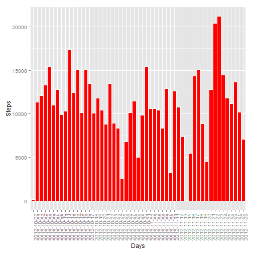
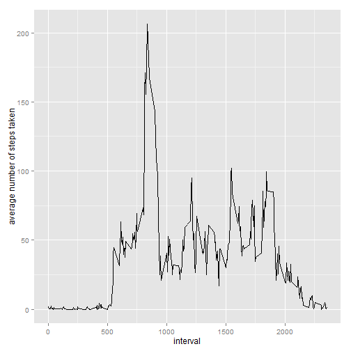
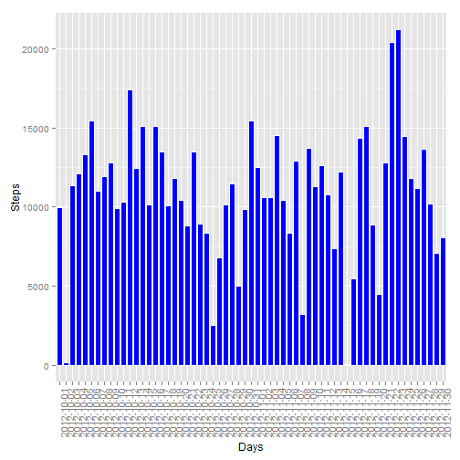
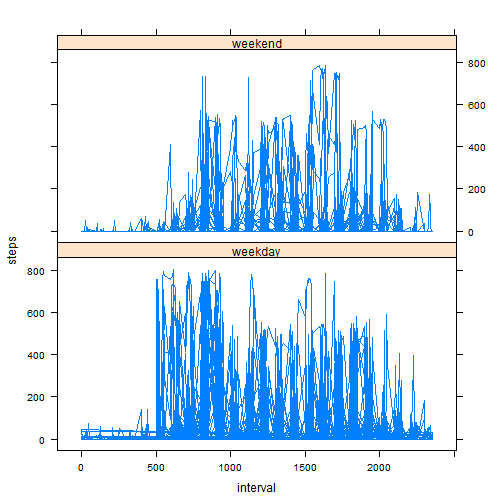

Peer Assessment 1
========================================================

This assignment contents multiple parts. The entire assignment is completed in a single R markdown document which was processed by knitr and be transformed into an HTML file.

Loading and preprocessing the data

```r
# Load the data
step <- read.csv("./activity.csv", stringsAsFactors = FALSE)
stepping <- na.omit(step)
```


Histogram of the total number of steps taken each day

```r
# Load plyr package
library("plyr")

# Create df for 'steps counting'
count <- ddply(stepping, .(date), summarize, steps = sum(steps))

# Load ggplot2 package
library("ggplot2")

# Histogram of the total number of steps taken each day
qplot(date, data = count, weight = steps) + geom_histogram(colour = "white", 
    fill = "red", binwidth = 0.5) + theme(axis.text.x = element_text(angle = 90)) + 
    xlab("Days") + ylab("Steps")
```

 


The mean and median total number of steps taken per day

```r
median(count$steps)
```

```
## [1] 10765
```

```r
mean(count$steps)
```

```
## [1] 10766
```


Average daily activity pattern

```r
# Time series plot of the 5-minute interval (x-axis) and the average number
# of steps taken
count_int <- ddply(stepping, .(interval), summarize, steps = mean(steps))
ggplot(count_int, aes(interval, steps)) + geom_line() + ylab("average number of steps taken")
```

 

```r

# Interval with maximum number of steps
count_int$interval[which.max(count_int$steps)]
```

```
## [1] 835
```


Imputing missing values

```r
# Imputing missing values Report the total number of missing values in the
# dataset
sum(is.na(step))
```

```
## [1] 2304
```

```r

# Filling in all of the missing values in the dataset
library("mice")
```

```
## Warning: package 'mice' was built under R version 3.0.3
```

```
## Loading required package: Rcpp
```

```
## Warning: package 'Rcpp' was built under R version 3.0.3
```

```
## mice 2.21 2014-02-05
```

```r
library("lattice")
```

```
## Warning: package 'lattice' was built under R version 3.0.3
```

```r

# Imputation with 'mice' function
step_imp = mice(step)
```

```
## 
##  iter imp variable
##   1   1  steps
##   1   2  steps
##   1   3  steps
##   1   4  steps
##   1   5  steps
##   2   1  steps
##   2   2  steps
##   2   3  steps
##   2   4  steps
##   2   5  steps
##   3   1  steps
##   3   2  steps
##   3   3  steps
##   3   4  steps
##   3   5  steps
##   4   1  steps
##   4   2  steps
##   4   3  steps
##   4   4  steps
##   4   5  steps
##   5   1  steps
##   5   2  steps
##   5   3  steps
##   5   4  steps
##   5   5  steps
```

```r

# Histogram of the total number of steps taken each day (after imputation)
count_imp <- ddply(complete(step_imp), .(date), summarize, steps = sum(steps))
qplot(date, data = count_imp, weight = steps) + geom_histogram(colour = "white", 
    fill = "blue", binwidth = 0.5) + theme(axis.text.x = element_text(angle = 90)) + 
    xlab("Days") + ylab("Steps")
```

 

```r

# The mean and median total number of steps taken per day
median(count_imp$steps)
```

```
## [1] 11162
```

```r
mean(count_imp$steps)
```

```
## [1] 10898
```

```r

# The impact of imputing missing data on the estimates of the total daily
# number of steps
ifelse(median(count$steps) < median(count_imp$steps), "Median of imputing dataset is bigger than previous one", 
    "Median of imputing dataset is smaller than previous one")
```

```
## [1] "Median of imputing dataset is bigger than previous one"
```

```r
ifelse(mean(count$steps) < mean(count_imp$steps), "Mean of imputing dataset is bigger than previous one", 
    "Mean of imputing dataset is smaller than previous one")
```

```
## [1] "Mean of imputing dataset is bigger than previous one"
```


The differences in activity patterns between weekdays and weekends

```r
# the dataset with two levels, indicating whether a given date is a weekday
# or weekend day.
week <- complete(step_imp)
week$date <- weekdays(as.Date(week$date))

week$date[week$date == "nede¾a" | week$date == "sobota"] <- "weekend"
week$date[week$date == "pondelok" | week$date == "utorok" | week$date == "streda" | 
    week$date == "štvrtok" | week$date == "piatok"] <- "weekday"

# Time series plot of the 5-minute interval (x-axis) and the average number
# of steps taken

xyplot(steps ~ interval | date, data = week, type = "l", layout = c(1, 2))
```

 


End of first peer assignment!
